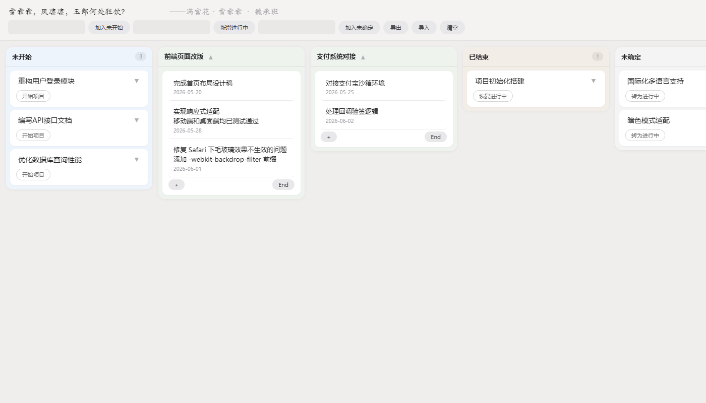

# Project Manager

## 功能

- **四列看板**：未开始 / 进行中 / 已结束 / 未确定
- **项目进展追踪**：每个进行中的项目独立一列，可添加多条进展记录（支持日期标注）
- **导入/导出**：JSON 格式一键备份和恢复数据
- **撤销删除**：误删可一键恢复
- **随机诗句**：顶部展示随机古诗词，来源 [今日诗词 API](https://www.jinrishici.com)
- **暗色模式**：跟随系统自动切换

## 使用方式

直接在浏览器中打开 `index.html` 即可使用，所有数据保存在浏览器本地存储（localStorage）中。

### 导入演示数据

1. 打开页面，点击顶栏 **导入** 按钮
2. 选择 `demo-data.json` 文件
3. 即可看到示例项目数据

## 交互说明

| 操作 | 方式 |
|------|------|
| 新增项目 | 在顶部输入框输入名称，点击对应按钮 |
| 修改项目名 | 点击项目标题文字 |
| 展开/收起进展 | 点击项目名旁的 ▼ / ▲ 箭头 |
| 添加进展 | 点击 ＋ 按钮，填写内容和日期 |
| 编辑进展 | 直接点击进展文字或日期即可编辑 |
| 删除进展 | 点击条目空白区域选中（蓝色描边），按 Delete 键 |
| 删除项目 | 点击卡片空白区域选中，按 Delete 键 |
| 撤销删除 | 点击顶栏 ↩ 按钮 |
| 移动项目 | 使用 开始项目 / 恢复进行中 / 转为进行中 / End 按钮 |

## 技术

纯静态 HTML/CSS/JS，无需构建工具，无外部依赖（诗句 API 除外）。

## License

MIT
